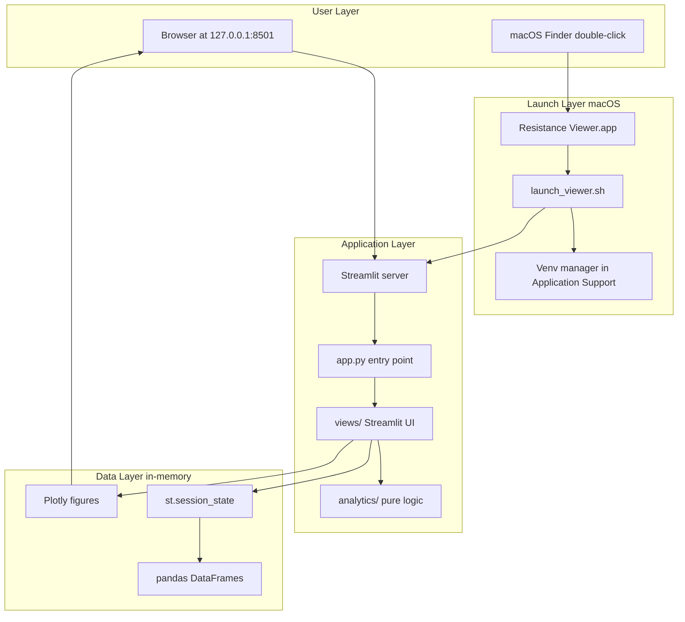
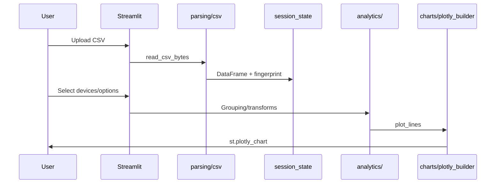

# Resistance Retention Viewer — Technical Documentation

## 1. Purpose and Features

### Purpose

**Resistance Retention Viewer** is a local desktop data-visualization tool for semiconductor / memristor crossbar experiments. It ingests **wide-format CSV exports** from lab instruments and renders interactive Plotly charts for resistance retention, IV sweeps, potential-depression (PD) curves, and cross-measurement correlation analysis.

Target users: researchers analyzing **16×16 crossbar arrays** where each device is named like `G3:0(S)` (conductance at row 3, column 0).

### Core Features

| Mode | Input | Primary visualization |
|------|-------|----------------------|
| **Resistance retention** | Wide CSV (time + per-device traces) | Resistance/conductance vs time |
| **IV characteristics** | Wide CSV (voltage + per-device current) | Current vs voltage |
| **Potential-Depression curve** | Wide CSV (pulse count + conductance/resistance) | Conductance vs pulse count + retention pulse planner |
| **Retention ↔ IV correlation** | Two CSVs (retention + IV) | Grouped charts, group alignment, statistical correlation |

**Cross-cutting capabilities:**

- Robust CSV parsing (comma/semicolon, European decimals, scientific notation)
- 16×16 crossbar checkbox grid for device selection
- Log/linear axes, conductance→resistance derivation (`R = 1/G`)
- Close-start value grouping with color-coded traces and group-average overlays
- IV curve similarity grouping (pairwise distance matrix)
- CSV export of filtered/transformed data
- Retention pulse planning from PD group-average curves
- Pearson, Spearman, and partial Pearson correlation analysis

---

## 2. Architecture

### High-level architecture



### Module layout

The application is split into focused packages under `src/resistance_viewer/`:

| Module | Responsibility |
|--------|----------------|
| [`app.py`](../src/resistance_viewer/app.py) | Streamlit entry point, mode routing |
| [`config.py`](../src/resistance_viewer/config.py) | `WideCsvViewConfig` and view constants |
| [`constants.py`](../src/resistance_viewer/constants.py) | Grid size, session keys, palette constants |
| [`parsing/csv.py`](../src/resistance_viewer/parsing/csv.py) | CSV decode, parse, column inference |
| [`models/crossbar.py`](../src/resistance_viewer/models/crossbar.py) | Crossbar cell parsing and column mapping |
| [`analytics/transforms.py`](../src/resistance_viewer/analytics/transforms.py) | Conductance/resistance transforms, normalization |
| [`analytics/grouping.py`](../src/resistance_viewer/analytics/grouping.py) | Close-start and IV-similarity grouping, ARI |
| [`analytics/iv.py`](../src/resistance_viewer/analytics/iv.py) | IV read resistance, curve distance |
| [`analytics/pd.py`](../src/resistance_viewer/analytics/pd.py) | PD curve analysis, pulse planning math |
| [`analytics/correlation.py`](../src/resistance_viewer/analytics/correlation.py) | Pearson/Spearman/partial correlation, device metrics |
| [`analytics/retention_fit.py`](../src/resistance_viewer/analytics/retention_fit.py) | Best-fit curves, group info tables |
| [`charts/plotly_builder.py`](../src/resistance_viewer/charts/plotly_builder.py) | Plotly figures, heatmaps, overlays |
| [`views/wide_csv.py`](../src/resistance_viewer/views/wide_csv.py) | Retention / IV / PD UI |
| [`views/correlation.py`](../src/resistance_viewer/views/correlation.py) | Retention ↔ IV correlation UI |
| [`views/crossbar_ui.py`](../src/resistance_viewer/views/crossbar_ui.py) | 16×16 checkbox grid |
| [`views/group_info.py`](../src/resistance_viewer/views/group_info.py) | Group statistics expander |

### Architectural characteristics

- **Streamlit as runtime**: UI reruns on every widget interaction; no separate API server.
- **Separation of analytics from UI**: Pure functions in `analytics/`, `parsing/`, and `charts/` are testable without Streamlit.
- **Stateless persistence**: No database; data survives only in `st.session_state` until refresh or restart.
- **Offline-first**: No network calls for data; fully local processing.

### Mode routing

[`main()`](../src/resistance_viewer/app.py) dispatches by sidebar radio to view modules. Three single-CSV modes share `WideCsvViewConfig` + `views/wide_csv.py`. Correlation mode uses `views/correlation.py`.

---

## 3. Folder Structure

```
resistance-retention-viewer/
├── README.md
├── docs/
│   └── TECHNICAL.md              # This document
├── pyproject.toml
├── requirements.txt
├── tests/                        # pytest suite
├── src/resistance_viewer/        # CANONICAL SOURCE
│   ├── app.py
│   ├── config.py
│   ├── constants.py
│   ├── parsing/
│   ├── models/
│   ├── analytics/
│   ├── charts/
│   └── views/
├── scripts/
│   ├── launch_viewer.sh
│   ├── register_app.sh           # Sync src/ into .app bundle
│   └── repair_viewer.sh
├── windows/
│   └── README.md                 # Windows run instructions (no source duplicate)
└── Resistance Viewer.app/        # macOS bundle (generated copy via register_app.sh)
```

**Runtime paths (outside repo, macOS only):**

- Venvs: `~/Library/Application Support/Resistance Viewer/venvs/<hash>/`
- Logs: `~/Library/Logs/Resistance Viewer/`
- PID file: `~/Library/Application Support/Resistance Viewer/streamlit.pid`

---

## 4. Dependencies

### Direct dependencies (`requirements.txt`)

| Package | Version constraint | Role |
|---------|-------------------|------|
| **streamlit** | `>=1.28,<2` | Web UI, file upload, session state |
| **pandas** | `>=2.0,<3` | CSV parsing, DataFrame transforms |
| **plotly** | `>=5.18,<6` | Interactive charts |
| **numpy** | `>=1.24,<3` | Numerical computation |

### System requirements

- Python 3.10+
- macOS 10.15+ for `.app` bundle
- `curl`, `lsof`, `osascript` (macOS launcher)

### Development dependencies (`pyproject.toml` optional)

- **pytest** — unit tests for analytics and parsing

---

## 5. Data Flow

### Single-CSV modes (Retention / IV / PD)



**Pipeline:**

1. **Ingestion:** `read_csv_bytes()` → `st.session_state[cfg.df_key]`
2. **Schema inference:** `infer_x_column()` / `infer_voltage_column()` / `infer_pulse_count_column()`
3. **Device mapping:** `parse_crossbar_cell()` → `crossbar_column_map()` → 16×16 grid
4. **Transforms:** `series_to_conductance()`, `relative_to_first_valid_percent()`, `close_start_groups()`
5. **Render:** `plot_lines()` → `add_group_summary_overlays()` → `st.plotly_chart()`

### Correlation mode

1. Upload retention + IV CSVs
2. Match devices by crossbar `(row, col)`
3. `_build_retention_iv_device_rows()` computes per-device metrics
4. Three tabs: **Grouped charts**, **Group alignment**, **Correlation analysis**

### Session state keys

| Key pattern | Content |
|-------------|---------|
| `retention_df`, `iv_df`, `pd_df` | Single-mode DataFrames |
| `corr_retention_df`, `corr_iv_df` | Correlation-mode DataFrames |
| `{wp}_cx_{ns}_{r}_{c}` | Crossbar checkbox states |
| `corr_iv_similarity_cache` | Cached IV distance matrix |

---

## 6. UI Components

All UI is Streamlit widgets — no separate frontend framework.

### Layout (single-CSV modes)

- **Sidebar:** upload, axis, log-Y, series selection
- **Main area:** crossbar grid + preview (left), chart panel (right)

### Navigation

- **Primary:** Sidebar `Measurement` radio — 4 modes
- **Secondary:** Correlation mode tabs — Grouped charts, Group alignment, Correlation analysis

### Styling

- Streamlit default theme, `layout="wide"`
- Plotly layout customization only; no custom CSS

---

## 7. Backend Logic

### CSV parsing

Tries five delimiter/decimal combinations; scores by column count and numeric cell fraction.

### Crossbar naming

Regex: `^(?:G|I|R)(\d+)[:\-](\d+)(?:\([^)]*\))?$` — grid bounds 0–15.

### Grouping algorithms

| Algorithm | Function | Used in |
|-----------|----------|---------|
| Close value | `close_value_groups()` | Retention, correlation |
| Close-start | `close_start_groups()` | Retention, PD |
| IV similarity | `iv_pairwise_distance_matrix()` + `groups_from_pairwise_distances()` | IV, correlation |
| Adjusted Rand Index | `adjusted_rand_index()` | Group alignment tab |

### IV read extraction

Read on **decreasing (return) branch** at signed read voltage; `R = V_read / I(V_read)`.

### PD retention pulse planner

Uses group-average conductance on first potentiation branch to recommend SET pulse counts.

---

## 8. Database / API Integrations

| Integration | Status |
|-------------|--------|
| Database | **None** |
| REST/GraphQL API | **None** |
| Cloud storage | **None** |
| Authentication | **None** (local-only) |

Data enters via `st.file_uploader`; exits via `st.download_button`. The macOS launcher alone calls `GET /_stcore/health`.

---

## 9. Deployment Setup

### Local desktop only

1. Git clone + `pip install -r requirements.txt` + `streamlit run`
2. macOS: double-click `Resistance Viewer.app`

After code changes:

```bash
./scripts/register_app.sh
```

If venv is corrupted:

```bash
./scripts/repair_viewer.sh
```

### Windows

Run from repo root (see [`windows/README.md`](../windows/README.md)):

```bash
python -m streamlit run src/resistance_viewer/app.py
```

---

## 10. Environment Variables

| Variable | Default | Purpose |
|----------|---------|---------|
| `PROJECT_ROOT` | Repo or bundled app path | Location of `requirements.txt` and `src/` |
| `RESISTANCE_VIEWER_PORT` | `8501` | Streamlit port |
| `RESISTANCE_VIEWER_PYTHON` | auto-detect | Override Python interpreter |

Streamlit flags (in launcher): `--server.headless true`, `--browser.gatherUsageStats false`.

---

## 11. Known Limitations

### Architectural

- Streamlit rerun model limits performance with 256 crossbar checkboxes
- No automated CI in repository (tests run locally via pytest)
- macOS `.app` bundle is an unsigned ad-hoc signed copy of `src/`

### Functional

- **16×16 grid only** — hardcoded `GRID_SIZE = 16`
- **Session-only state** — no project save/load
- **Large files** — entire CSV loaded into memory
- **macOS-centric packaging** — Windows/Linux lack equivalent launcher
- **Unsigned macOS app** — may require right-click → Open on first launch

---

## 12. Recommendations for Modernization

### Completed in this refactor

- Split monolithic `app.py` into modules
- Wired correlation analysis tab
- Removed duplicate `windows/app/` source copy
- Added pytest for core analytics/parsing

### Future work

- `@st.cache_data` for parsed DataFrames
- Configurable grid size
- Project/session persistence (local JSON or SQLite)
- Cross-platform packaging (PyInstaller)
- CI/CD with GitHub Actions
- macOS notarization
- Optional batch CLI for headless analysis
